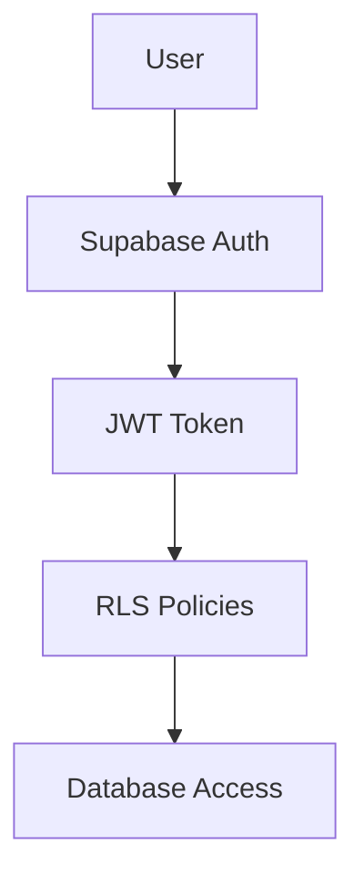

# 🏗️ Driplo.bg Technical Stack & Architecture

## Frontend Architecture

### Core Framework
```yaml
Framework: SvelteKit 2.27+
Svelte Version: 5.37+ (with runes)
Language: TypeScript 5.x (strict mode)
Build Tool: Vite 7.x
```

### UI & Styling
```yaml
UI Framework: Skeleton UI v2.x
Theme: "modern" preset (clean, professional)
CSS Framework: Tailwind CSS v3.x
Icons: Lucide Svelte
Fonts: System fonts (Inter fallback)
```

### State Management
```yaml
Global State: Svelte 5 runes ($state, $derived)
Local State: Component-level $state()
Authentication: Supabase Auth + custom store
Real-time: Supabase subscriptions
```

## Backend Architecture

### Database & Auth
```yaml
Database: Supabase PostgreSQL
Authentication: Supabase Auth
File Storage: Supabase Storage
Real-time: Supabase Subscriptions
Edge Functions: Supabase Functions (when needed)
```

### Database Design

#### Core Tables
```sql
-- User profiles (extends Supabase auth.users)
profiles {
  id: uuid (PK, FK to auth.users)
  display_name: text
  avatar_url: text
  phone: text
  location: text
  rating: decimal(2,1)
  total_sales: integer
  is_verified: boolean
}

-- Product listings
products {
  id: uuid (PK)
  title: text (required, min 3 chars)
  description: text (max 1000 chars)
  price: decimal(10,2) (required, > 0)
  images: text[] (max 5 items)
  category: text (required)
  condition: text (enum)
  size: text (optional)
  brand: text (optional)
  location: text (required)
  is_active: boolean (default true)
  is_sold: boolean (default false)
  view_count: integer (default 0)
  user_id: uuid (FK to auth.users)
  created_at: timestamp
  updated_at: timestamp
}

-- Messaging system
messages {
  id: uuid (PK)
  product_id: uuid (FK to products)
  sender_id: uuid (FK to auth.users)
  receiver_id: uuid (FK to auth.users)
  content: text (max 500 chars)
  is_read: boolean (default false)
  created_at: timestamp
}

-- User favorites
favorites {
  user_id: uuid (FK to auth.users)
  product_id: uuid (FK to products)
  created_at: timestamp
  PK: (user_id, product_id)
}
```

#### Row Level Security (RLS)
```sql
-- Products: Public read, owner write
"Products are viewable by everyone" (SELECT: is_active = true)
"Users can manage their own products" (INSERT/UPDATE/DELETE: auth.uid() = user_id)

-- Profiles: Public read basic info, owner write
"Public profiles viewable" (SELECT: true)
"Users can update own profile" (UPDATE: auth.uid() = id)

-- Messages: Private between sender/receiver
"Users can view their messages" (SELECT: auth.uid() IN (sender_id, receiver_id))
"Users can send messages" (INSERT: auth.uid() = sender_id)

-- Favorites: Private to user
"Users can manage own favorites" (ALL: auth.uid() = user_id)
```

## File Structure

### Application Structure
```
src/
├── lib/
│   ├── components/              # UI Components (max 10)
│   │   ├── ProductCard.svelte   # Product display card
│   │   ├── ProductForm.svelte   # Create/edit form
│   │   ├── SearchBar.svelte     # Search with filters
│   │   ├── UserProfile.svelte   # User profile display
│   │   └── MessageThread.svelte # Chat interface
│   ├── stores/                  # Global state management
│   │   ├── auth.ts              # Authentication state
│   │   ├── products.ts          # Product management
│   │   └── notifications.ts     # App notifications
│   ├── utils/                   # Utility functions
│   │   ├── supabase.ts          # Supabase client setup
│   │   ├── validation.ts        # Form validation schemas
│   │   ├── constants.ts         # App constants
│   │   └── helpers.ts           # General helpers
│   └── types/                   # TypeScript definitions
│       ├── database.ts          # Generated DB types
│       └── app.ts               # App-specific types
├── routes/                      # SvelteKit pages
│   ├── +layout.svelte           # App shell with navigation
│   ├── +layout.ts               # Layout data loader
│   ├── +page.svelte             # Homepage
│   ├── +page.ts                 # Homepage data loader
│   ├── auth/                    # Authentication pages
│   │   ├── login/+page.svelte
│   │   └── signup/+page.svelte
│   ├── sell/                    # Selling workflow
│   │   └── +page.svelte
│   ├── products/                # Product pages
│   │   ├── +page.svelte         # Search results
│   │   ├── +page.ts             # Search data loader
│   │   └── [id]/
│   │       ├── +page.svelte     # Product detail
│   │       └── +page.ts         # Product data loader
│   ├── profile/                 # User profile pages
│   │   ├── +page.svelte         # View profile
│   │   └── edit/+page.svelte    # Edit profile
│   └── messages/                # Messaging
│       └── +page.svelte         # Messages inbox
├── app.html                     # HTML template
└── hooks.server.ts              # Server-side auth
```

### Component Design Principles

#### Skeleton UI Usage
```svelte
<!-- Use Skeleton components exclusively -->
<script>
  import { 
    AppShell, AppBar, Card, Button, 
    InputChip, Avatar, ProgressBar 
  } from '@skeletonlabs/skeleton';
</script>

<!-- Clean, minimal structure -->
<Card class="p-4 space-y-4">
  <header class="flex justify-between items-center">
    <h2 class="h3">Product Title</h2>
    <Button size="sm">Action</Button>
  </header>
  <div class="space-y-2">
    <!-- Content -->
  </div>
</Card>
```

#### Svelte 5 Patterns
```svelte
<script lang="ts">
  // Props (read-only)
  let { product, onUpdate } = $props();
  
  // Local state
  let isLoading = $state(false);
  let formData = $state({
    title: product?.title ?? '',
    price: product?.price ?? 0
  });
  
  // Derived state
  let isValid = $derived(
    formData.title.length >= 3 && formData.price > 0
  );
  
  // Effects
  $effect(() => {
    console.log('Product changed:', product);
  });
  
  // Event handlers
  async function handleSubmit() {
    isLoading = true;
    try {
      await onUpdate?.(formData);
    } finally {
      isLoading = false;
    }
  }
</script>
```

## Performance Optimization

### Bundle Optimization
```yaml
Code Splitting: Automatic route-based splitting
Tree Shaking: Dead code elimination
Image Optimization: Responsive images with loading="lazy"
Font Loading: System fonts to avoid FOIT
CSS Purging: Unused Tailwind classes removed
```

### Runtime Optimization
```yaml
SSR: Server-side rendering for SEO
Preloading: Link prefetching on hover
Caching: Static asset caching
Compression: Gzip/Brotli compression
CDN: Static assets served from CDN
```

### Database Optimization
```sql
-- Indexes for common queries
CREATE INDEX products_category_idx ON products(category);
CREATE INDEX products_location_idx ON products(location);
CREATE INDEX products_created_at_idx ON products(created_at DESC);
CREATE INDEX products_user_id_idx ON products(user_id);

-- Full-text search index
CREATE INDEX products_search_idx ON products 
USING gin(to_tsvector('bulgarian', title || ' ' || coalesce(description, '')));
```

## Security Architecture

### Authentication Flow


### Data Validation
```typescript
// Input validation with Zod
import { z } from 'zod';

const productSchema = z.object({
  title: z.string().min(3).max(100),
  price: z.number().positive().max(10000),
  category: z.enum(CATEGORIES),
  condition: z.enum(CONDITIONS),
  images: z.array(z.string().url()).max(5)
});
```

### File Upload Security
```typescript
// Image upload constraints
const MAX_FILE_SIZE = 5 * 1024 * 1024; // 5MB
const ALLOWED_TYPES = ['image/jpeg', 'image/png', 'image/webp'];

// Server-side validation
function validateImageUpload(file: File) {
  if (file.size > MAX_FILE_SIZE) throw new Error('File too large');
  if (!ALLOWED_TYPES.includes(file.type)) throw new Error('Invalid file type');
}
```

## Deployment Architecture

### Development Environment
```yaml
Local Database: Supabase CLI (Docker)
Development Server: Vite dev server
Hot Reloading: Enabled
Type Checking: Real-time with svelte-check
```

### Production Environment
```yaml
Hosting: Vercel/Netlify (static)
Database: Supabase Cloud
CDN: Automatic (Vercel/Netlify)
SSL: Automatic HTTPS
Monitoring: Built-in analytics
```

### CI/CD Pipeline
```yaml
Code Quality:
  - TypeScript type checking
  - ESLint linting
  - Prettier formatting
  - Unit tests (Vitest)
  - E2E tests (Playwright)

Build Process:
  - Static site generation
  - Asset optimization
  - Bundle analysis
  - Performance testing

Deployment:
  - Automatic on main branch
  - Preview deployments on PRs
  - Database migrations
  - Environment variable management
```

## Monitoring & Analytics

### Performance Metrics
```yaml
Core Web Vitals:
  - First Contentful Paint: <1.5s
  - Largest Contentful Paint: <2.5s
  - Cumulative Layout Shift: <0.1
  - First Input Delay: <100ms

Business Metrics:
  - Page views
  - User registrations
  - Product listings created
  - Messages sent
  - Search queries
```

### Error Tracking
```yaml
Client Errors: Console logging + Sentry (future)
Server Errors: Supabase logs
Performance: Web Vitals API
User Analytics: Privacy-focused analytics
```

## Scalability Considerations

### Database Scaling
```yaml
Read Replicas: Supabase auto-scaling
Connection Pooling: Built-in pgBouncer
Query Optimization: Indexed queries
Data Archiving: Soft delete pattern
```

### Application Scaling
```yaml
Static Hosting: Global CDN distribution
API Caching: Supabase Edge Cache
Image Optimization: Responsive images
Bundle Splitting: Route-based chunks
```

### Future Enhancements
```yaml
Search: Elasticsearch/Algolia integration
Cache: Redis for session storage
Queue: Background job processing
Mobile: Progressive Web App features
Internationalization: Multi-language support
```

---

**Architecture Principles:**
1. **Simplicity First** - Choose boring, proven technologies
2. **Performance by Default** - Optimize for speed from day one
3. **Developer Experience** - Fast feedback loops and great tooling
4. **User Privacy** - Minimal data collection, GDPR compliant
5. **Maintainability** - Clear patterns, good documentation

**Last Updated**: 2025-08-05  
**Version**: 1.0